<div align="center">

# 👨‍💻 Noman Khan

### 🧠 AI Engineer in Progress | 🚀 Future Innovator | 🤖 Machine Learning Explorer


</div>

---

<p align="center">
  <a href="https://github.com/Noman-khan25">
    
  </a>
  <a href="https://www.linkedin.com/in/noman-khan25">
    
  </a>
  <a href="https://www.instagram.com/nomankhann123">
    
  </a>
</p>

---

## 🌌 About Me

🎓 **Bachelor of Artificial Intelligence (BS AI)**
**Sir Syed University of Engineering & Technology | 2025–2029**

🤖 Passionate about **Artificial Intelligence, Machine Learning, and Data Science**

🧠 Currently exploring **Deep Learning, Neural Networks, NLP, and Generative AI**

⚡ Building **intelligent systems and AI-powered applications**

🚀 Aspiring **AI Engineer** focused on developing innovative, real-world AI solutions

💡 *“Transforming ideas into intelligent solutions through Artificial Intelligence.”*


---

## 🛠 Tech Stack

### Programming Languages
<p>
  
</p>

### AI & Machine Learning
<p>
  
</p>

- NumPy
- Pandas
- Scikit-Learn
- Matplotlib
- Seaborn
- Jupyter Notebook

### Tools & Platforms
<p>
  
</p>

---

## 🧠 AI Knowledge

✔ Machine Learning

✔ Deep Learning Fundamentals

✔ Neural Networks

✔ Data Preprocessing

✔ Model Evaluation

✔ Natural Language Processing (NLP)

✔ AI Chatbots

✔ Classification & Regression Models

---

## 🚀 Current Projects

### 🤖 AI Chat Assistant
NLP-based chatbot capable of handling user interactions.

### 🧠 Artificial Neural Network
Building and training basic neural network models.

### 📊 Machine Learning Models
Working on classification and prediction systems using Scikit-Learn.

### 🔍 Data Analysis Projects
Exploring datasets and extracting meaningful insights.

---

## 📚 Currently Learning

- Deep Learning
- Computer Vision
- Advanced Neural Networks
- PyTorch
- Generative AI
- Large Language Models (LLMs)

---

## 📈 GitHub Analytics

<p align="center">
  
  
</p>

<p align="center">
  
</p>

---

## 🏆 GitHub Trophies

<p align="center">
  
</p>

---

## 🌐 Connect With Me

<p align="center">
  <a href="https://github.com/Noman-khan25">
    
  </a>

  <a href="https://www.linkedin.com/in/noman-khan25">
    
  </a>
</p>

---

## ⚡ Fun Fact

```python
while True:
    learn_ai()
    build_projects()
    improve_skills()
```

### Output

🚀 Future AI Engineer Loading...

---

<p align="center">
  <b>⭐ Thanks for visiting my profile!</b><br>
  <b>Let's build the future with AI 🤖</b>
</p>

<p align="center"><b>⭐ If you like my work, drop a star on my repositories!</b></p>

